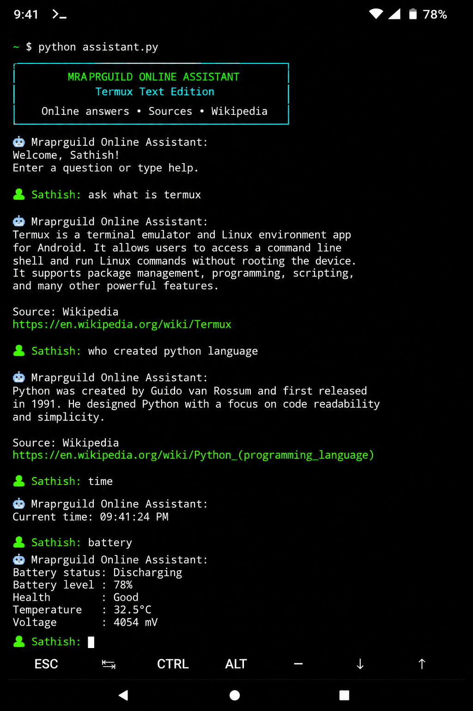
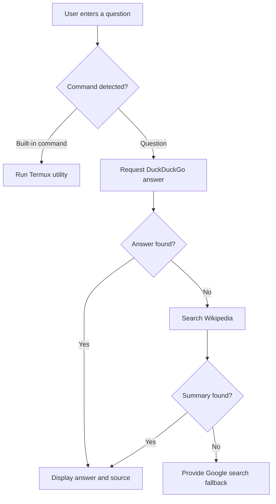

<div align="center">


<br>

<a href="https://github.com/Mraprguild">
  
</a>

<br>

[](https://www.python.org/)
[](https://f-droid.org/packages/com.termux/)
[](LICENSE)
[](#requirements)
[](#)

<br>

**A modern command-line assistant that searches online sources, displays useful answers, includes source links, and provides Termux device utilities.**

<br>



<br>

[Features](#-features) •
[Installation](#-installation) •
[Commands](#-commands) •
[Examples](#-usage-examples) •
[Structure](#-project-structure) •
[Author](#-author)

</div>

---

## ✨ Overview

**Mraprguild Online Assistant** is a lightweight Python-powered text assistant built for Termux on Android. It accepts normal-language questions, retrieves public online information, presents readable results, and displays the source whenever one is available.

The assistant combines:

- DuckDuckGo instant answers
- Wikipedia article search and summaries
- Google search fallback
- Termux device commands
- A colored interactive terminal interface
- A simple one-command installer
- A permanent launcher alias

> [!NOTE]
> This project uses public online endpoints. An active internet connection is required for online answers.

---

## 🚀 Features

<table>
<tr>
<td width="50%">

### 🌐 Online Answers

Ask questions directly from the Termux terminal. Normal text is automatically treated as a question.

</td>
<td width="50%">

### 📚 Wikipedia Search

Search Wikipedia and display a concise article summary with its original page link.

</td>
</tr>

<tr>
<td width="50%">

### 🔗 Source Response

Supported answers include the source name and URL to help users verify the information.

</td>
<td width="50%">

### 🔍 Search Fallback

When a direct response is unavailable, the assistant provides a Google search URL.

</td>
</tr>

<tr>
<td width="50%">

### 📱 Termux Utilities

Check battery status, storage usage, system information, current date, and current time.

</td>
<td width="50%">

### 🎨 Terminal Interface

Includes a colorful header, readable prompts, status messages, and clean command output.

</td>
</tr>

<tr>
<td width="50%">

### ⚡ Lightweight

Uses Python and the `requests` package without a large framework or database.

</td>
<td width="50%">

### 🛠️ Easy Installation

The included installer configures dependencies, executable permissions, and the launcher alias.

</td>
</tr>
</table>

---

## 📋 Requirements

Before installation, make sure you have:

| Requirement | Details |
|---|---|
| Android | Android device supported by Termux |
| Termux | Install the current Termux build from F-Droid |
| Internet | Required for online answers and searches |
| Python | Installed automatically by the setup script |
| Requests | Installed automatically from `requirements.txt` |
| Termux:API | Optional, used for battery and Android utility commands |

> [!IMPORTANT]
> The Play Store version of Termux is outdated. The F-Droid or official GitHub release is recommended.

---

## 📦 Installation

### Method 1 — Install from GitHub

```bash
pkg update -y
pkg install git -y
git clone https://github.com/Mraprguild/termux-online-assistant.git
cd termux-online-assistant
chmod +x install.sh
./install.sh
```

### Method 2 — Install from ZIP

```bash
pkg update -y
pkg install unzip -y
unzip termux-online-assistant.zip
cd termux-online-assistant
chmod +x install.sh
./install.sh
```

### Method 3 — Manual Installation

```bash
pkg update -y
pkg install python termux-api -y
pip install -r requirements.txt
chmod +x assistant.py start.sh
./start.sh
```

---

## ▶️ Run the Assistant

Run from the project folder:

```bash
./start.sh
```

Or run the Python file directly:

```bash
python assistant.py
```

After running `install.sh`, start it from anywhere using:

```bash
mra-assistant
```

---

## 🧠 Commands

| Command | Description | Example |
|---|---|---|
| `ask <question>` | Get an online answer | `ask what is Termux` |
| `wiki <topic>` | Search Wikipedia | `wiki artificial intelligence` |
| `search <text>` | Open Google search results | `search Python tutorial` |
| `open <url>` | Open a website | `open github.com` |
| `battery` | Display battery status | `battery` |
| `storage` | Display storage usage | `storage` |
| `device` | Display device and Python details | `device` |
| `time` | Display current time | `time` |
| `date` | Display current date | `date` |
| `clear` | Clear the terminal screen | `clear` |
| `help` | Display the command guide | `help` |
| `exit` | Close the assistant | `exit` |

Normal sentences work without the `ask` command:

```text
Who created Python?
What is artificial intelligence?
Explain the Linux operating system.
```

---

## 💻 Usage Examples

### Ask an online question

```text
👤 Sathish: ask what is Termux

🤖 Mraprguild Online Assistant:
Termux is a terminal emulator and Linux environment application for Android.

Source: Wikipedia
https://en.wikipedia.org/wiki/Termux
```

### Search Wikipedia

```text
👤 Sathish: wiki Python programming language
```

### Check the current time

```text
👤 Sathish: time

🤖 Mraprguild Online Assistant:
Current time: 09:41:24 PM
```

### Check battery information

```text
👤 Sathish: battery
```

---

## 🖼️ Screenshot

<div align="center">


<br>

<sub>Online answers, sources, device information, and a colorful Termux interface.</sub>

</div>

---

## 🗂️ Project Structure

```text
termux-online-assistant/
│
├── assistant.py
│   └── Main online assistant application
│
├── install.sh
│   └── Automated Termux installation script
│
├── start.sh
│   └── Project launcher
│
├── requirements.txt
│   └── Python dependency list
│
├── README.md
│   └── Project documentation
│
├── LICENSE
│   └── MIT license
│
└── assets/
    └── screenshot.png
        └── Assistant terminal screenshot
```

---

## ⚙️ How It Works



1. The assistant reads the terminal input.
2. Built-in commands are processed locally.
3. Questions are sent to the DuckDuckGo instant-answer endpoint.
4. Wikipedia is used when the first source does not return an answer.
5. A Google search link is shown when no direct summary is available.
6. The result and available source URL are displayed in Termux.

---

## 🎨 Interface Details

The terminal theme uses ANSI colors:

| Element | Theme |
|---|---|
| Assistant title | Cyan |
| Project banner | Green and cyan |
| User prompt | Bright green |
| Online search status | Yellow |
| Assistant response | White |
| Source links | Bright green |
| Errors and warnings | Readable terminal messages |

The interface is designed to remain clear on both dark and light-compatible Termux color schemes, though a dark background is recommended.

---

## 🔧 Customization

Open `assistant.py` and edit:

```python
ASSISTANT_NAME = "Mraprguild Online Assistant"
USER_NAME = "Sathish"
```

You can change:

- Assistant name
- User display name
- Terminal colors
- Welcome banner
- Available commands
- Online endpoints
- Timeout duration
- Default search provider

### Change the user name

```python
USER_NAME = "Your Name"
```

### Change the assistant name

```python
ASSISTANT_NAME = "My Termux Assistant"
```

---

## 🛡️ Error Handling

The assistant handles common issues such as:

- No internet connection
- Request timeout
- Invalid JSON responses
- Missing Termux:API package
- Empty questions
- Unknown commands
- Keyboard interruption
- End-of-file terminal events

When no direct answer is found, the program falls back to a standard search URL rather than stopping unexpectedly.

---

## 🔐 Privacy

The project does not include a local account system or database.

Questions sent through online answer features are transmitted to the selected public endpoint. Review the relevant service privacy policies before entering personal or confidential information.

> [!WARNING]
> Do not enter passwords, API keys, banking information, private tokens, or other sensitive information into online search requests.

---

## 🧪 Troubleshooting

### `ModuleNotFoundError: No module named requests`

```bash
pip install requests
```

### `termux-battery-status: command not found`

```bash
pkg install termux-api -y
```

Also install the separate **Termux:API** Android application.

### Permission denied

```bash
chmod +x install.sh start.sh assistant.py
```

### Launcher command not found

Reload the Termux shell:

```bash
source ~/.bashrc
```

Then run:

```bash
mra-assistant
```

### Internet response failed

Check the connection:

```bash
ping -c 3 wikipedia.org
```

Then run the assistant again.

---

## 🗺️ Roadmap

- [x] DuckDuckGo instant-answer support
- [x] Wikipedia summaries
- [x] Source URL display
- [x] Search fallback
- [x] Battery and storage commands
- [x] Colored terminal interface
- [x] Automated installer
- [ ] Optional AI API integration
- [ ] Conversation history
- [ ] Multiple language mode
- [ ] Voice input with Termux:API
- [ ] Config file for user preferences
- [ ] Plugin command system

---

## 🤝 Contributing

Contributions, fixes, and feature suggestions are welcome.

```bash
git clone https://github.com/Mraprguild/termux-online-assistant.git
cd termux-online-assistant
git checkout -b feature/my-new-feature
```

After making changes:

```bash
git add .
git commit -m "Add a new feature"
git push origin feature/my-new-feature
```

Create a pull request from your fork or feature branch.

---

---

## ©️ Copyright

<div align="center">

**Copyright © 2026 Mraprguild. All rights reserved.**

This project is distributed under the terms of the [MIT License](LICENSE).

Unauthorized removal of the original copyright and attribution notice is not permitted.

</div>

## 📄 License

This project is released under the [MIT License](LICENSE).

You may use, modify, and distribute the code while keeping the license notice.

---

## 👨‍💻 Author

<div align="center">

### Mraprguild

[](https://github.com/Mraprguild)

**Termux projects • WordPress development • Online tools • Open-source utilities**

<br>


</div>

---

<div align="center">

### ⭐ Support the Project

If this project is useful, give the repository a star and share it with other Termux users.


</div>
